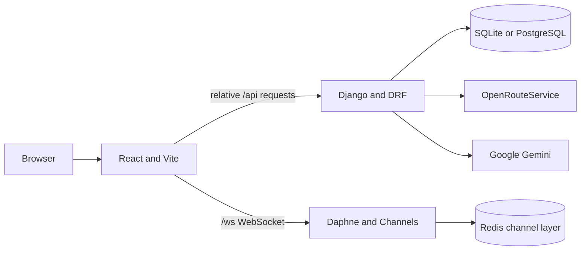

# Lock-Ad v3 Project Guide

## Purpose and stack

Lock-Ad provides cautious walking-route guidance in the Philippines using route geometry and community or public safety context. Never describe a route as guaranteed safe.

- Backend: Python 3.12, Django 6.0.6, Django REST Framework 3.17.1, Django Channels/Daphne.
- Frontend: React 19, React Router 7, Vite 8, Tailwind CSS 4, Leaflet.
- Data: SQLite when `DJANGO_DEBUG=True`; PostgreSQL and Redis when debug is false (as in Docker Compose).
- Providers: OpenRouteService for routing; Google Gemini for advisories and, in the current incident-image work, moderator review aids.
- Shape: modular Django monolith plus a separate React SPA; REST API and authenticated WebSockets.

## Architecture and request flow



For a route preview, `frontend/src/api/navigation.js` gets a CSRF token and sends a relative request through `frontend/src/api/client.js`. Django dispatches it through `backend/backend/urls.py` and `backend/navigation/urls.py`; the view validates with `RoutePreviewRequestSerializer`, delegates provider work to `navigation/services.py`, adds context from `navigation/scoring.py`, and returns JSON. State-changing browser requests use session cookies and `X-CSRFToken`.

## Important paths

- `backend/backend/`: settings, root HTTP routes, ASGI and WSGI entry points.
- `backend/accounts/`: registration, login, logout, CSRF bootstrap and current-user endpoints.
- `backend/navigation/`: route request validation, OpenRouteService integration, saved routes and scoring.
- `backend/safety_data/`: incident and signal models, APIs, image handling, Gemini integration and Channels consumer/signals.
- `backend/emergency/`: emergency-contact API and model.
- `backend/core/`: liveness and dependency-readiness endpoints.
- `frontend/src/api/`: API helpers and fetch client.
- `frontend/src/context/`, `hooks/`, `components/`, `pages/`: auth and route state, reusable UI, guards and screens.
- `architecture/`, `docs/`: architecture decisions and project/developer documentation.

## Conventions

- Python modules and functions use `snake_case`; React components use PascalCase JSX files and JavaScript functions use `camelCase`.
- Keep HTTP input validation in DRF serializers. Keep provider calls in service modules rather than React or serializers.
- Keep session authentication and CSRF protection. Enforce permissions on the server and scope user-owned querysets; frontend route guards are only a UI layer.
- Only moderator-approved incident reports affect route scoring or avoidance; image-backed incident submissions have a separate 20-per-user-per-day throttle.
- Uploaded incident images are private, use random storage names, and are removed when their report is deleted. The public Gemini advisory endpoint validates numeric inputs and has separate anonymous and authenticated limits.
- Use relative `/api/...` paths in frontend code. Reuse the API client for credentials, JSON, CSRF headers, and API errors.
- Django tests use `unittest`/`TestCase` and DRF `APITestCase`, primarily in each app's `tests.py`; standalone `backend/test_*.py` files also exist. No frontend test script or test files were detected.
- Recent commits use conventional prefixes such as `feat:`, `fix:`, `test:`, `docs:`, and `build:`. Branches use names such as `feature/...`.
- Follow `.agents/AGENTS.md` for the project's detailed security, accessibility, review and handoff practices.

## Common commands

Run backend commands from `backend/` after creating the virtual environment and configuring `backend/.env`:

```bash
cd backend
python -m venv venv
source venv/bin/activate
pip install -r requirements.txt
test -f .env || cp .env.example .env
python manage.py migrate
python manage.py runserver 8004
python manage.py test
python manage.py check
```

Run frontend commands from `frontend/`:

```bash
cd frontend
npm install
npm run dev
npm run lint
npm run build
```

Run the containerized stack from the repository root:

```bash
docker compose up --build
```

`backend/.env.example` is a template; create `backend/.env` and set the required local values. For Docker Compose, also copy the repository root `.env.example` to `.env` and set a strong database password. Do not commit either file. Standalone SQLite development uses `DJANGO_DEBUG=True`; Compose overrides it to false and uses PostgreSQL and Redis. Compose publishes the frontend on port 8003 and backend on port 8004.

## Setup note

The Vite proxy and developer guides use backend port 8004 so API and WebSocket requests reach either the local server started with `python manage.py runserver 8004` or the Compose backend. Set `DJANGO_DEBUG=True` for standalone SQLite; Compose forces it to false.
