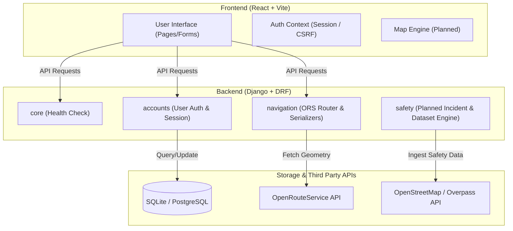

# Lock-Ad v3 System Architecture

Lock-Ad v3 is designed as a modular, safety-aware navigation platform for the Philippines. This folder serves as the central documentation for the system's structural layout, showing how current components function and where future components will integrate.

## System Topology

Below is the high-level flow of the application:

---

## Architectural Principles

1. **Separation of Concerns**: Backend business logic is split into standalone Django applications (`accounts`, `navigation`, `core`, `safety`). The frontend interacts with these cleanly via JSON API endpoints.
2. **Backend-Heavy Routing**: All complex routing calculations, API key access, and safety weight scores are processed on the backend. The frontend remains thin and presentational.
3. **Session-Based State**: User sessions are persisted via standard secure Django session cookies instead of local state storage, protecting against XSS token extraction.
4. **Advisory Framing**: System interfaces and data pipelines are built to communicate *cautious advice* rather than absolute safety guarantees. 

## Documentation Map

To deep dive into specific layers of the system:
- **[Backend Architecture](backend.md)**: Details Django apps, authentication patterns, endpoints, and the upcoming routing service layer.
- **[Frontend Architecture](frontend.md)**: Details the Vite build structure, React routing, guard components, and auth providers.
- **[Long-Term Product Vision](../docs/Lock-Ad_v3_Long-Term_Vision.md)**: Explains product philosophy and the staging plan for community and AI features.

---

## Navigation & Product Vocabulary

Always use the following vocabulary across the codebase and user interface:

| Preferred Vocabulary | Unacceptable Vocabulary |
| :--- | :--- |
| `cautious route` | `guaranteed safe route` |
| `risk-aware route` | `crime-free path` |
| `safety-related signals` | `protected route` |
| `route context / advisory` | `secure navigation` |
