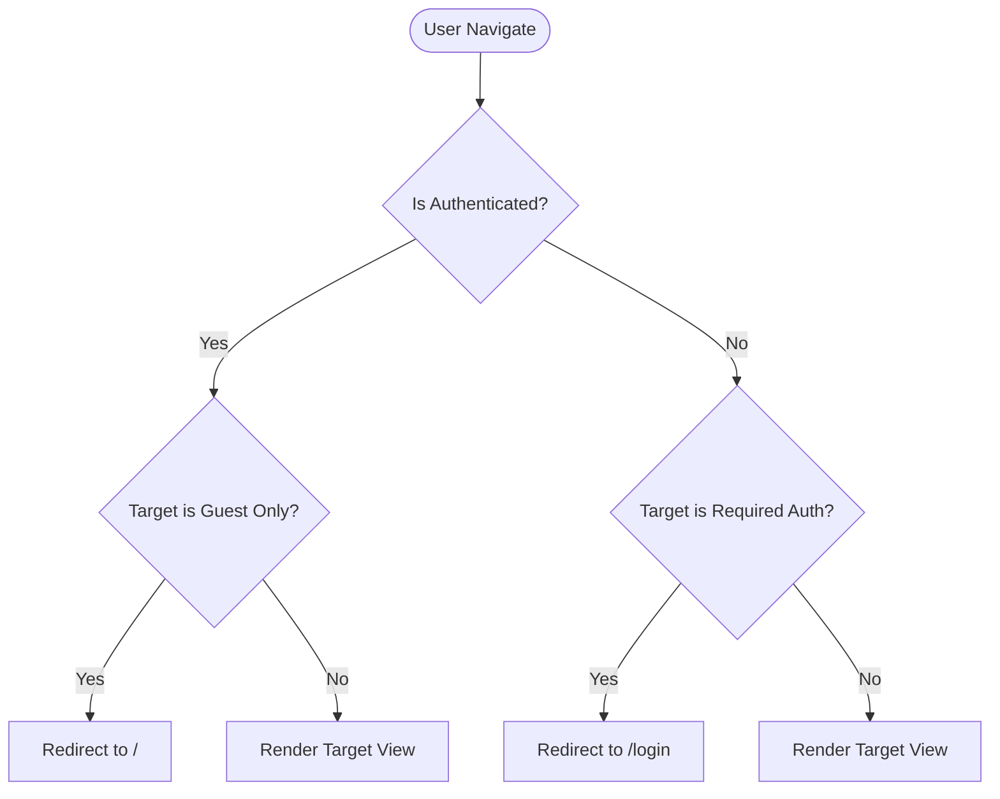

# Frontend Architecture

The frontend of Lock-Ad v3 is a modern React application built and bundled using **Vite**. It targets pedestrian route previews, rendering map graphics, and managing user interaction states.

---

## Completed Frontend Architecture

### 1. Project Bundler & API Proxying

The frontend lives in `/frontend` and utilizes **Vite** for the development environment and bundle builds.

- **Proxy Configuration**: To bypass Cross-Origin Resource Sharing (CORS) limits during local development, `vite.config.js` is configured to proxy all traffic starting with `/api` to the backend server at `http://127.0.0.1:8000`.
- **Relative Pathing**: All frontend requests use clean, relative URIs (e.g. `/api/auth/login/`) instead of hardcoding absolute domains.

### 2. State & Authentication Context

Authentication state is managed globally:

- **`AuthContext`**: Exposes authentication actions and current session attributes across the application.
- **`AuthProvider`**: Wrapper component rendering at the root of the React app tree:
  - Executes a handshake upon loading (`loadCurrentUser()`) to check if the browser has a valid, active Django session.
  - Exposes functions: `login(credentials)`, `register(userData)`, and `logout()`.
- **`useAuth`**: A custom hook facilitating clean, readable context imports for pages/components.

### 3. Route Gating & Router Hierarchy

We leverage `react-router-dom` v7 for layout paths and router navigation:

- **`RequireAuth`**: Inspects `isAuthenticated` from `useAuth()`. If the session is invalid or loading, it locks access and routes to `/login`. Used for the root homepage (`/`).
- **`GuestOnlyRoute`**: Blocks authenticated users from returning to login/registration fields. Used for `/login` and `/register`.

### 4. Interactive Pages

- `LoginPage`: Renders credentials inputs, manages local forms state, submits to `login()` of `useAuth()`, and handles API credentials errors.
- `RegisterPage`: Handles form validation (matching password, non-empty usernames) and registration logic.

---

## Planned Frontend Modules

### 1. Map Interface Component

- Integration of a responsive web mapping library (such as Leaflet or Mapbox).
- Dynamic rendering of coordinates returned from the backend `/api/navigation/routes/preview/` endpoint.

### 2. Route Control Forms

- Origin/Destination entry fields (using geocoding services to resolve search terms to coordinate points).
- Detailed visualization panel for routing statistics (distance in kilometers/meters, walking duration in minutes, and hazard alerts).
