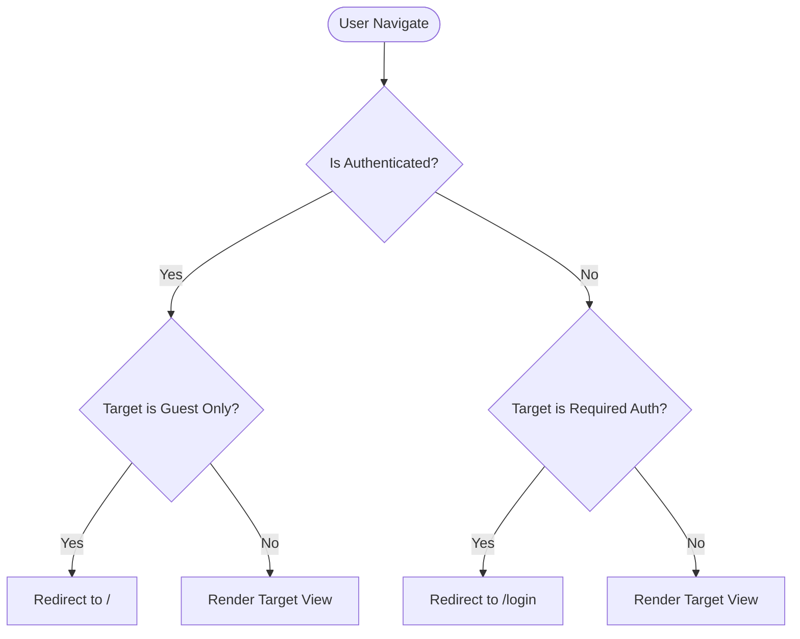

# Frontend Architecture

The frontend of Lock-Ad v3 is a modern React application built and bundled using **Vite**. It targets pedestrian route previews, rendering map graphics, and managing user interaction states.

---

## Completed Frontend Architecture

### 1. Project Bundler & API Proxying

The frontend lives in `/frontend` and utilizes **Vite** for the development environment and bundle builds.

- **Proxy Configuration**: During local development, `vite.config.js` proxies `/api` requests and `/ws` WebSockets to the backend at `http://127.0.0.1:8004`.
- **Relative Pathing**: All frontend requests use clean, relative URIs (e.g. `/api/auth/login/`) instead of hardcoding absolute domains.

### 2. State & Authentication Context

Authentication state is managed globally:

- **`AuthContext`**: Exposes authentication actions and current session attributes across the application.
- **`AuthProvider`**: Wrapper component rendering at the root of the React app tree:
  - Executes a handshake upon loading (`loadCurrentUser()`) to check if the browser has a valid, active Django session.
  - Exposes functions: `login(credentials)`, `register(userData)`, and `logout()`.
- **`useAuth`**: A custom hook facilitating clean, readable context imports for pages/components.

### 3. Route Gating & Router Hierarchy

We leverage `react-router-dom` v7 for layout paths and router navigation:

```mermaid
graph TD
    User([User Navigate]) --> CheckAuth{Is Authenticated?}
    
    CheckAuth -->|Yes| GateA{Target is Guest Only?}
    CheckAuth -->|No| GateB{Target is Required Auth?}
    
    GateA -->|Yes| RedirectHome[Redirect to /]
    GateA -->|No| RenderGuest[Render Target View]
    
    GateB -->|Yes| RedirectLogin[Redirect to /login]
    GateB -->|No| RenderAuth[Render Target View]
```

- **`RequireAuth`**: Inspects `isAuthenticated` from `useAuth()`. If the session is invalid or loading, it locks access and routes to `/login`. Used for authenticated routes.
- **`GuestOnlyRoute`**: Blocks authenticated users from returning to login/registration fields. Used for `/login` and `/register`.
- The moderator route also checks `user.is_staff` in the UI; API permissions remain enforced by Django.

### 4. Interactive Pages

- `LoginPage`: Renders credentials inputs, manages local forms state, submits to `login()` of `useAuth()`, and handles API credentials errors.
- `RegisterPage`: Handles form validation (matching password, non-empty usernames) and registration logic.
- `RoutePlanner`: Route request UI, map display, route summary, and safety-related context.
- `EmergencyContactsPage`: Emergency contact management.
- `ModeratorDashboard`: Staff-only report review, image preview, and status actions.
- `Map`: Leaflet map for route and safety layers, incident filters, report submission, and live approved-incident updates.
